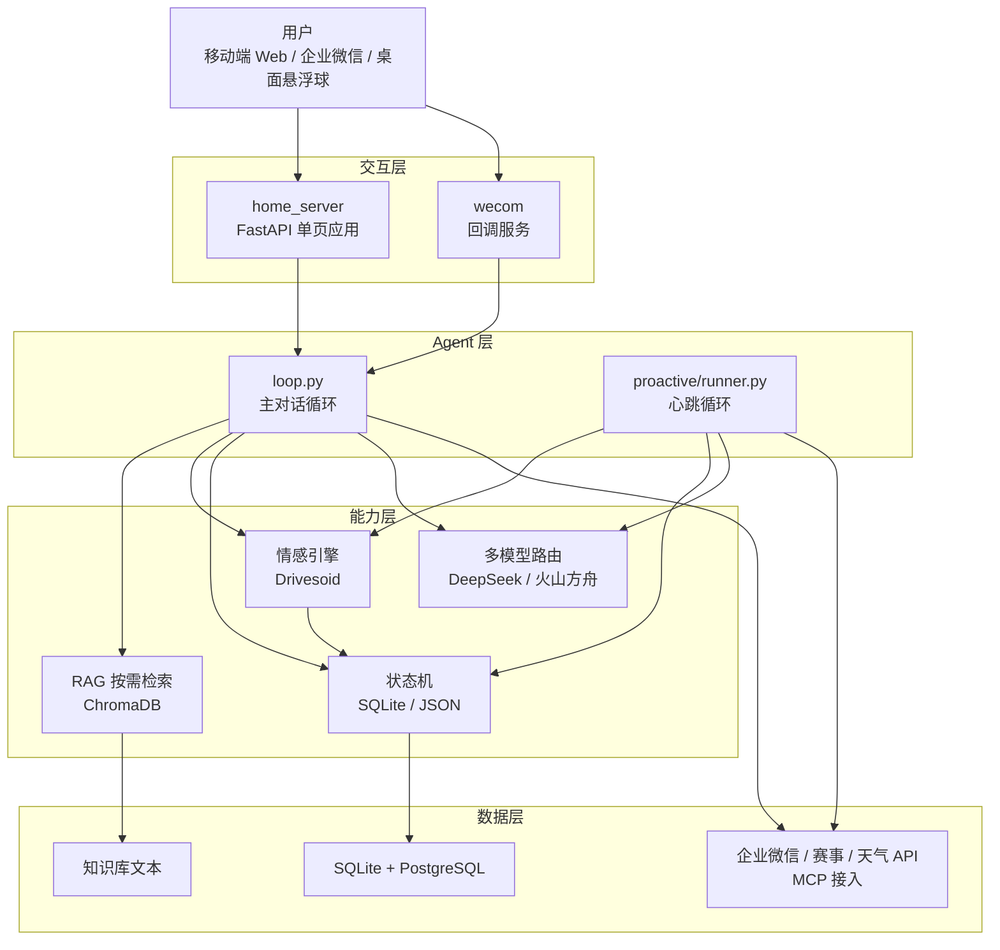

# Kairos Agent

> 一个具备主动意识、长期记忆与情感引擎的 AI 陪伴 Agent，通过多模型成本路由实现可持续运行。

**核心差异化：**

- 🧠 **主动式 Agent**：心跳循环驱动，在合适时机主动发起对话，而非被动等待。
- 💰 **多模型成本路由**：根据任务复杂度动态选择模型，大幅降低 token 消耗。
- ❤️ **独立情感引擎**：跨端同步的情感状态，让陪伴更连贯。
- 📱 **三端一致**：移动端 Web、桌面悬浮球、企业微信推送无缝协同。

[](https://python.org)
[](https://nodejs.org)
[](https://fastapi.tiangolo.com)
[](https://modelcontextprotocol.io)
[](./LICENSE)

---

## 一句话说清楚

市面上大多数"AI 伴侣"是**被动应答**：你不发消息，它永远沉默。
Kairos 做的是**主动式**：它维护一套连续的情感状态和角色状态机，在训练间隙、比赛日、睡前等真实场景里**自己决定要不要开口**，并且记得三个月前你提过的事。

三个工程上真正难的点：
- **主动性**：什么时候该说话、什么时候该闭嘴——这是可用性问题，不是模型问题
- **成本**：主动触发意味着请求量是被动聊天的数倍，必须有成本控制
- **一致性**：跨 Web / 企业微信 / 桌面三端，状态不能穿帮

---

## ⚠️ 关于本仓库（重要）

这是一个**脱敏展示版**，用于展示系统架构与工程能力，**不是可直接部署的生产版本**。

- `backend/home/` 下引用的部分业务模块（赛事抓取、状态规则、聊天历史等）因涉及第三方数据源与个人数据，**已在公开版中移除**；移动端 Web 主链路无法在本仓库内单独启动。
- `wecom/`（企业微信接入）与 `backend/drivesoid/`（情感引擎）**相对独立，可独立运行**，见下方"快速开始"。
- 如需完整运行移动端 Web，需自行补齐被移除的模块，接口约定见 `docs/`。

---

## 快速开始

### 1. 情感引擎（Drivesoid，独立可跑）

需要 Node.js ≥ 18。

```bash
cd backend/drivesoid
cp .env.example .env   # 按需填入配置
npm install
npm start              # REST 服务，默认端口 :24601
# 或
npm run mcp            # 以 MCP Server 形式启动
```

### 2. 企业微信接入（独立可跑）

```bash
cd wecom
pip install -r ../backend/requirements.txt
# 凭据写入 ~/.kairos/wecom_config.json
#   corp_id / agent_id / secret / token / encoding_aes_key
python run.py          # 监听 0.0.0.0:8765
```

### 3. 移动端 Web 与主动触发（需补齐模块后运行）

```bash
cd backend
pip install -r requirements.txt
# LLM 三路 API 配置写入 ~/.kairos/config.json（api_key / base_url / model）
export APP_TIMEZONE=Asia/Shanghai   # 可选，默认 UTC

python home/home_server.py   # 移动端 Web
python proactive/runner.py   # 主动触发心跳
```

注意：`home_server.py` 依赖若干在公开版中移除的业务模块，直接启动会报 `ModuleNotFoundError`，需自行补齐。

---

## 项目规模

- **Python 7,677 行 / 46 文件**，**JavaScript 2,163 行 / 9 文件**（不含依赖与生成物）
- 核心后端模块 **45 个**，FastAPI 路由 **52 条**（21 GET / 31 POST）
- RAG 知识库 **7 类**，MCP 工具 **3 个**（情感引擎服务端）
- 三端入口（移动 Web / 企微 / 桌面），情感引擎独立进程（REST + MCP 双协议）
- 开发周期：2026年9月13日 – 9月24日，独立开发。

---

## 系统能力

| 能力 | 说明 |
| --- | --- |
| 🧠 长周期记忆 | ChromaDB 向量检索 + 多知识库按需注入，7 类知识域 |
| 💓 连续情感状态 | 独立 Node.js 情感引擎，多维情感向量，聊天 ↔ 状态双向闭环 |
| ⏰ 主动触发 | 心跳循环 + 场景上下文拼装，Agent 自主决定推送 / 记录 / 沉默 |
| 🔀 多模型路由 | DeepSeek + 火山方舟三 API，按峰谷定价与调用来源动态切换 |
| 📱 三端一致 | 移动端 Web / 企业微信 / 桌面悬浮球共用同一状态层 |
| 🔌 外部集成 | MCP 协议接入赛事数据，Open-Meteo 天气，企业微信推送 |

---

## 架构



- **数据层**：SQLite + PostgreSQL (Supabase)——热数据本地化（聊天历史、状态 JSON 单机零运维），云侧做知识库与备份。
- **AI 层**：RAG 按需检索（关键词命中才注入）/ 情感引擎（独立进程多维状态）/ Agent 主动触发（心跳循环）/ 多模型路由（峰谷 + 来源 + 配额三层切换）。
- **集成层**：MCP 协议（stdio JSON-RPC）/ 企业微信推送 / 内网穿透。
- **交互层**：移动端 Web（FastAPI 单页）/ 多页面 / 桌面悬浮球（Electron）。

---

## 四个技术亮点

### 1. 主动式 Agent：从"应答"到"发起"

大多数 LLM 应用是 request-response。Kairos 加了一个**心跳循环**（`proactive/runner.py`），周期性评估"此刻是否适合主动说一句话"：

- 拼装场景上下文（训练间隙 / 比赛日 / 返程 / 睡前）
- 调用 LLM 生成候选"念头"，再决定推送企微、写日记、发朋友圈，或者什么都不做
- 与**角色状态机**联动：`home_state.json` 记录当天的在家 / 外出 / 比赛状态，过期自动滚动，聊天中信号可回写覆盖

**工程难点在于"克制"**：主动性做过头就是骚扰。系统实现了可用性门控——睡觉 / 比赛 / 会议场景直接拦截，训练间隙允许短回复，连续未回触发安抚兜底而非追加推送。

**实测数据**（来自本地 `proactive/state/`）：66 次念头评估中，仅 23 次判定"开口"（`spoken=True`），**43 次主动沉默，沉默率 65%**。系统真正做的是"决定不打扰"，而不是"找机会说话"。

### 2. 多模型成本路由：让请求量翻倍而成本不失控

主动触发意味着请求量是被动模式的数倍。系统实现了三层路由（`backend/config.py`）：

- **按定价时段**：DeepSeek 官方峰谷定价，高峰期自动切到火山方舟的闲时资源
- **按调用来源**：网页端与企微端走不同配额池
- **按用量自动回退**：本地累计 token 计量（`api_usage.py`），配额耗尽自动降级到兜底 API

配合 **RAG 按需检索**（关键词命中才注入知识片段，日常闲聊完全不检索）+ 30 分钟天气缓存 + 思考链长度上限，在保证体验的前提下控制单次请求成本。

**实测数据**（`backend/logs/usage.log`，2026-09-18 → 09-27，9 天 704 次调用）：**91.8% 的调用落在闲时资源，闲时段 token 占 93.6%**（峰段 8.2% 调用 / 6.4% token）。主动触发带来的增量请求，绝大部分被路由到了低价资源池。

### 3. 连续情感引擎（独立 Node.js 服务）

不是让 LLM"扮演"情绪，而是让情绪成为一个**独立进程里的可查询状态**（`backend/drivesoid/`，端口 24601）：

- 维护 **16 维连续值**（longing / intimacy / vitality / jealousy / anxiety / contentment / elation / possessiveness 等），每维带独立的时间常数、峰值时刻与振幅参数
- 主对话循环周期性拉取情感上下文注入系统提示，聊天中的情感变化回写
- 双入口设计：REST API + MCP 服务，既可被 Python 调用，也可被其他 MCP 客户端消费

**架构意义**：把"情感"从 prompt 里的一次性文本，变成可持久化、可观测、可测试的状态机。配套 Python 心跳引擎（`companion_awakening/`）负责生成"念头"。

**实测数据**：**累积 6,541 条状态快照**，每条含完整 16 维取值，可供回溯、可视化与调参。两套情感状态（Node 引擎 16 维 / Python 念头引擎 8 字段）通过映射同步。

### 4. 移动端工程化与三端一致

`home_server.py`（FastAPI）提供移动端 Web，包含聊天、来电、朋友圈、日记、日历、冰箱、看球复盘、约会计划等模块。真正的坑在 **iOS Safari**：

- `position:fixed` + `100vh` 规避地址栏伸缩导致的视口跳动与软键盘顶起错位
- `-webkit-backdrop-filter` 双写兼容毛玻璃
- `-webkit-overflow-scrolling:touch` + `overscroll-behavior:contain` 防滚动穿透
- `Intl.DateTimeFormat` 绕过 Safari 对 `toLocaleString` 的兼容差异
- 前后端共用 `APP_TIMEZONE`，支持任意 IANA 时区，默认 UTC

三端共用同一 SQLite 聊天历史与状态文件，回复与状态实时一致。

**实测规模**：移动端 Web 聊天库累积 463 条消息，其中 70 条带思考链；企微去重消息 ID 248 条。三端状态实时一致，无跨端穿帮。

---

## 限制与反思

项目在 12 天内独立完成，做了刻意取舍。以下问题尚未解决，或只做到"能跑"而非"可靠"：

- **主动触发的误报率没有系统评估**。目前只能从 66 次念头评估中 23 次开口、43 次沉默推断出"克制"倾向，但"该说时说了"与"不该说时说了"的区分缺乏标注数据。可用性门控依赖硬编码规则（睡觉 / 比赛 / 会议），规则覆盖不到的场景可能误伤或误放。
- **情感引擎存在冷启动问题**。16 维状态的初始值靠手工设定，缺乏"从零建立关系"的渐进曲线；状态重置后情感反馈会显得突兀。
- **多模型路由的切换对用户不可见，但延迟有代价**。峰谷切换与配额回退都发生在请求侧，用户无感知，但跨 API 的响应延迟差异没有做过量化对比。
- **三端一致只在在线场景验证过**。三端共用 SQLite 状态层要求同时可访问同一存储；离线或弱网下多端同时写入状态时的冲突合并未做处理。
- **评估数据来自单人 12 天使用**。66 次念头、704 次调用、6,541 条快照均为开发期自测，样本量不足以支撑普适结论，只能说明"机制在跑"，不能说明"效果好"。
- **公开版无法端到端运行**。`home_server.py` 依赖被移除的业务模块，读者只能验证情感引擎与企业微信两个独立组件，主链路需自行补齐。

---

## 第三方组件与许可

- 本仓库原创代码以 **MIT** 许可开源（见根目录 `LICENSE`，Copyright (c) 2026 Kairos Project）。
- `backend/drivesoid/` 为**独立开源组件**（情感引擎），遵循其自带 **CC-BY-NC-SA-4.0** 许可（见 `backend/drivesoid/LICENSE`）。
- 商用场景建议将情感引擎替换为自研实现——架构已解耦（REST + MCP 双入口），替换不影响主链路。
